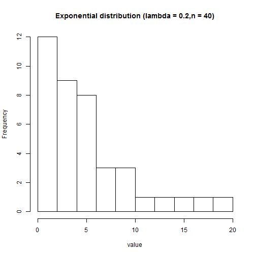
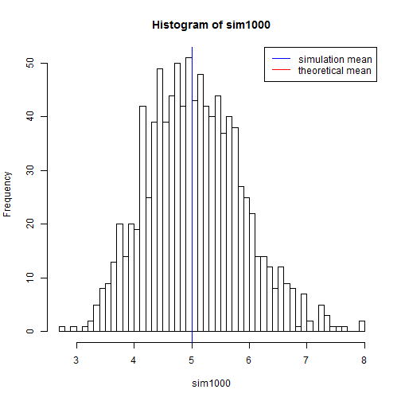
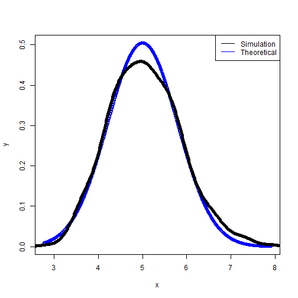
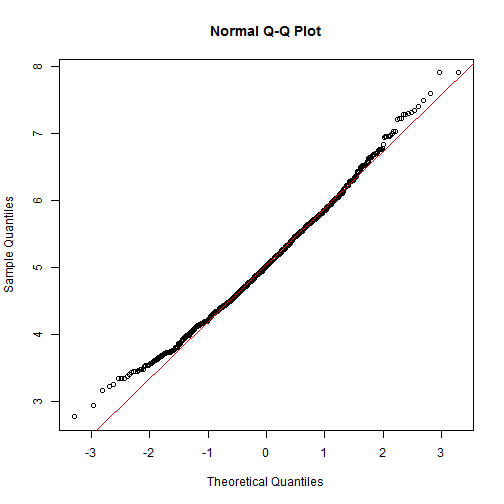

### **Overview:** 
Exponential distribution measures the length of interval between occurences or time to complete a task. The rate parameter is lambda. Hence, the mean or the expected value is 1/lambda. The variance is 1/(lambda^2), and standard derivation is 1/lambda.

In this exercise, I seek to determine the mean and variance of the distribution of 40 exponentials, with lambda as 0.2. I will also determine if the distribution of the mean of 1000 simulations is a normal distribution.

Simulation: Exponential distribution is simuated with the following rexp(n, lambda), where n is the sample size, and lambda is the rate parameter. Setting lambda = 0.2, and the sample size = 40. I set the simulation to 'sim' and show the first 10 values.

```r
sim <- rexp(40, 0.2)
head(sim, 10)
```

```
##  [1]  7.2915807  0.5681514  4.5603662  2.5148683 11.6879810  3.2851201
##  [7]  4.6076913  4.0256596  3.6282229  2.2573341
```
The distribution of the values is shown:

```r
hist(sim, xlab="value", main="Exponential distribution (lambda = 0.2,n = 40)")
```

 

### Mean and Standard Derivation

For distribution of mean in 1000 simulations, I use the following code:

```r
sim1000 = NULL
for (i in 1:1000) sim1000 = c(sim1000, mean(rexp(40, 0.2)))

hist(sim1000, breaks=50)
abline(v=1/0.2, col="red")
abline(v=5, col="blue")
legend('topright', c("simulation mean", "theoretical mean"), lty=c(1,1), col=c("blue", "red"))
```

 

The expected mean of exponential distribution is 1/lambda, and in this case, is expected to be 1/0.2, which is 5. In my simulation, the actual mean, shown below, is very close to the expected (theoretical) mean.

```r
mean(sim1000)
```

```
## [1] 5.055969
```


To calculate the variance of the result of 1000 simulations:


```r
var(sim1000)
```

```
## [1] 0.6797415
```

The expected variance of exponential distribution is ((1/lambda)^2)/n, and in this case, is ((1/0.2)^2)/40, or 0.625. This is very close to the expected (theoretical) value as shown above.

### Is the distribution of sampling 40 exponentials normal?

I compare normal distribution with distribution of simulation:

```r
x <- seq(min(sim1000), max(sim1000), length=1000)
y <- dnorm(x, mean=1/0.2, sd=(1/0.2/sqrt(40)) )
plot(x, y, col="blue", lwd=1)
lines(density(sim1000), col="black", lwd=5)
legend('topright', c("Simulation", "Theoretical"), col =c("black","blue"), lty=c(1,1))
```

 

The two distributions are very similar.


I also use I Q-Q plot:


```r
qqnorm(sim1000);qqline(sim1000, col = 2)
```

 

Thus, the distribution is very close to normal.


