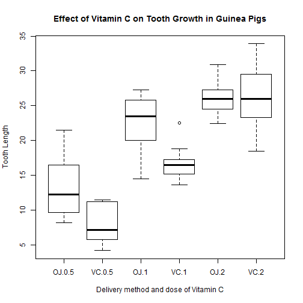

### Background:
In this report, I analyze the ToothGrowth data package. This study assesses the effect of Vitamin C on tooth growth of Guinea pigs.
It contains measurement of the length of odontoblasts (teeth) in each of 10 guinea pigs at each of three dose levels of Vitamin C (0.5, 1, and 2 mg) with each of two delivery methods (orange juice or ascorbic acid).

A data frame with 60 observations on 3 variables.

[,1]	 len	 numeric	 Tooth length

[,2]	 supp	 factor	 Supplement type (VC or OJ).

[,3]	 dose	 numeric	 Dose in milligrams.

Source

C. I. Bliss (1952) The Statistics of Bioassay. Academic Press.

References

McNeil, D. R. (1977) Interactive Data Analysis. New York: Wiley.

### Analysis

Loading the data:

```r
data("ToothGrowth")				
d<-as.data.frame(ToothGrowth)
```

Summary of the dataframe:

```r
str(ToothGrowth)
```

```
## 'data.frame':	60 obs. of  3 variables:
##  $ len : num  4.2 11.5 7.3 5.8 6.4 10 11.2 11.2 5.2 7 ...
##  $ supp: Factor w/ 2 levels "OJ","VC": 2 2 2 2 2 2 2 2 2 2 ...
##  $ dose: num  0.5 0.5 0.5 0.5 0.5 0.5 0.5 0.5 0.5 0.5 ...
```

Obtaining the mean of tooth length in the six groups:

```r
xtabs(len~supp+dose, aggregate(len~supp+dose, d, mean))
```

```
##     dose
## supp   0.5     1     2
##   OJ 13.23 22.70 26.06
##   VC  7.98 16.77 26.14
```

Plotting tooth length of the six groups:

```r
boxplot(len~supp+dose, data=d, xlab="Delivery method and dose of Vitamin C", ylab="Tooth Length", main="Effect of Vitamin C on Tooth Growth in Guinea Pigs")
```

 

Table of summary of each group:


```r
library(plyr)
ddply(d, c("supp", "dose"), summarise, 
		N = length(len),
		min = min(len), 		
		median = median(len),		
        mean = mean(len),	       	
		max = max(len),
        se   = sd(len) / sqrt(N))
```

```
##   supp dose  N  min median  mean  max        se
## 1   OJ  0.5 10  8.2  12.25 13.23 21.5 1.4102837
## 2   OJ  1.0 10 14.5  23.45 22.70 27.3 1.2367520
## 3   OJ  2.0 10 22.4  25.95 26.06 30.9 0.8396031
## 4   VC  0.5 10  4.2   7.15  7.98 11.5 0.8685620
## 5   VC  1.0 10 13.6  16.50 16.77 22.5 0.7954104
## 6   VC  2.0 10 18.5  25.95 26.14 33.9 1.5171757
```

where N is sample size, min is minimum value, max is maximum value, se is standard error.

Each dose group is subsetted into a different data frame for further analysis:


```r
d05<-d[d$dose==0.5,]
d1<-d[d$dose==1.0,]
d2<-d[d$dose==2.0,]
```

Using t-test, I compare the effect of different delivery method on tooth length:

Dose = 0.5 mg, comparing OJ versus VC:


```r
lapply(d05[1], function(x) t.test(x ~ d05$supp, var.equal = FALSE))
```

```
## $len
## 
## 	Welch Two Sample t-test
## 
## data:  x by d05$supp
## t = 3.1697, df = 14.969, p-value = 0.006359
## alternative hypothesis: true difference in means is not equal to 0
## 95 percent confidence interval:
##  1.719057 8.780943
## sample estimates:
## mean in group OJ mean in group VC 
##            13.23             7.98
```

Dose = 1 mg, comparing OJ versus VC:


```r
lapply(d1[1], function(x) t.test(x ~ d1$supp, var.equal = FALSE))
```

```
## $len
## 
## 	Welch Two Sample t-test
## 
## data:  x by d1$supp
## t = 4.0328, df = 15.358, p-value = 0.001038
## alternative hypothesis: true difference in means is not equal to 0
## 95 percent confidence interval:
##  2.802148 9.057852
## sample estimates:
## mean in group OJ mean in group VC 
##            22.70            16.77
```

Dose = 2 mg, comparing OJ versus VC:


```r
lapply(d2[1], function(x) t.test(x ~ d2$supp, var.equal = FALSE))
```

```
## $len
## 
## 	Welch Two Sample t-test
## 
## data:  x by d2$supp
## t = -0.046136, df = 14.04, p-value = 0.9639
## alternative hypothesis: true difference in means is not equal to 0
## 95 percent confidence interval:
##  -3.79807  3.63807
## sample estimates:
## mean in group OJ mean in group VC 
##            26.06            26.14
```

### Conclusion:
At doses of 0.5 or 1 mg of Vitamin C, delivery by Orange Juice produced longer teeth. However, at 2 mg of Vitamin C, delivery by either method produce similar tooth length in Guinea pigs.

Assumptions:

1. All other factors besides delivery method and doses are controlled.
2. Guinea pigs were randomly assigned to each group and are representative of the general population.
3. Data are collected by "blind" personel(s) in this experiment.


